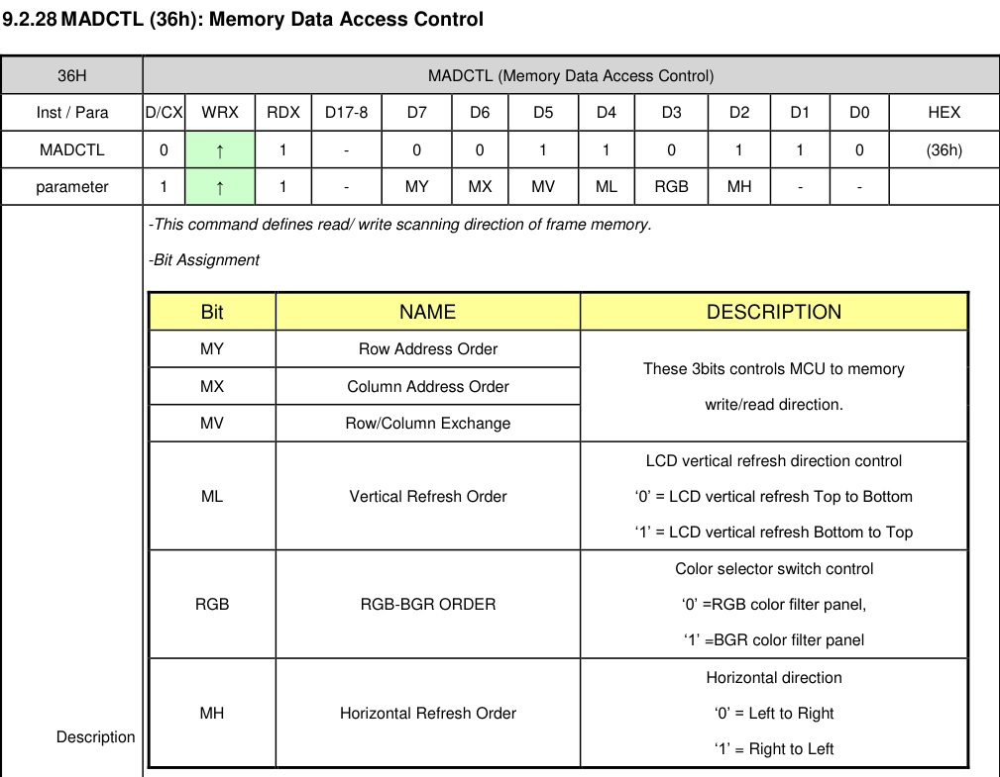

# 适配新屏幕

本文介绍了如何将该项目的驱动程序适配到新的屏幕，下面以 [CL35BC1017-40A](https://item.taobao.com/item.htm?_u=o1m6r7hs443f&id=746237125081&spm=a1z09.2.0.0.7df32e8dWy47pb&skuId=5148438405653) (现有型号CL35BC219-40A 的 TFT<sup>1</sup> 版本) 为例来介绍整个适配过程。

## 准备工作

首先确定目标屏幕的接口类型，目前驱动程序仅支持 SPI 接口的屏幕。

### 1. 向卖家询问参考代码、规格书等资料。

如下若干链接是卖家要提供的资料

#### 参考代码、数据手册、规格书、工具
```c
通过百度网盘分享的文件：CL35BC21...等2个文件
链接：https://pan.baidu.com/s/1_mew0c8wx63OXkk8YCp92w 
提取码：4ppi 
复制这段内容打开「百度网盘APP 即可获取」
```

#### 官方转接板 PCB 工程

```c
通过百度网盘分享的文件：AD6.9封装及CAD图纸
链接：https://pan.baidu.com/s/1WeMawyqmnGqY73WaojkwNg 
提取码：6953 
复制这段内容打开「百度网盘APP 即可获取」
```

### 2. 根据资料，提取出屏幕的初始化代码

```c
LCD_RST_SET;
delay_ms(1);
LCD_RST_CLR;
delay_ms(10);
LCD_RST_SET;
delay_ms(120);

//************* Start Initial Sequence **********//
delay_ms(120); // Delay 120ms

// =========== 上面的部分是复位操作 ==================

LCD_WR_REG(0x11); // Sleep Out
delay_ms(120); // Delay 120ms
LCD_WR_REG(0xf0) ;
LCD_WR_DATA(0xc3) ;
LCD_WR_REG(0xf0) ;
LCD_WR_DATA(0x96) ;
LCD_WR_REG(0x36);
LCD_WR_DATA(0x48); 
LCD_WR_REG(0x3A);
LCD_WR_DATA(0x55);
LCD_WR_REG(0xB4);
LCD_WR_DATA(0x01);
LCD_WR_REG(0xB7) ;
LCD_WR_DATA(0xC6) ;
LCD_WR_REG(0xe8);
LCD_WR_DATA(0x40);
LCD_WR_DATA(0x8a);
LCD_WR_DATA(0x00);
LCD_WR_DATA(0x00);
LCD_WR_DATA(0x29);
LCD_WR_DATA(0x19);
LCD_WR_DATA(0xa5);
LCD_WR_DATA(0x33);
LCD_WR_REG(0xc1);
LCD_WR_DATA(0x06);
LCD_WR_REG(0xc2);
LCD_WR_DATA(0xa7);
LCD_WR_REG(0xc5);
LCD_WR_DATA(0x18);
LCD_WR_REG(0xe0); //Positive Voltage Gamma Control
LCD_WR_DATA(0xf0);
LCD_WR_DATA(0x09);
LCD_WR_DATA(0x0b);
LCD_WR_DATA(0x06);
LCD_WR_DATA(0x04);
LCD_WR_DATA(0x15);
LCD_WR_DATA(0x2f);
LCD_WR_DATA(0x54);
LCD_WR_DATA(0x42);
LCD_WR_DATA(0x3c);
LCD_WR_DATA(0x17);
LCD_WR_DATA(0x14);
LCD_WR_DATA(0x18);
LCD_WR_DATA(0x1b);
LCD_WR_REG(0xe1); //Negative Voltage Gamma Control
LCD_WR_DATA(0xf0);
LCD_WR_DATA(0x09);
LCD_WR_DATA(0x0b);
LCD_WR_DATA(0x06);
LCD_WR_DATA(0x04);
LCD_WR_DATA(0x03);
LCD_WR_DATA(0x2d);
LCD_WR_DATA(0x43);
LCD_WR_DATA(0x42);
LCD_WR_DATA(0x3b);
LCD_WR_DATA(0x16);
LCD_WR_DATA(0x14);
LCD_WR_DATA(0x17);
LCD_WR_DATA(0x1b);
LCD_WR_REG(0xf0);
LCD_WR_DATA(0x3c);
LCD_WR_REG(0xf0);
LCD_WR_DATA(0x69);
delay_ms(120); //Delay 120ms
LCD_WR_REG(0x29);// Display on
```

## 添加显示屏型号支持

先拉取驱动代码仓库
```bash
git clone https://github.com/embeddedboys/rpi_dm_yt350s006_software.git
cd rpi_dm_yt350s006_software
```

### 1. 添加 [rpi-dm-cl35bc1017-40a.txt](https://github.com/embeddedboys/rpi_dm_yt350s006_software/blob/main/rpi-dm-cl35bc1017-40a.txt)

根据提取的初始化代码，编写 mipi-cmd 源文件，这里新建一个文件命名为 [`rpi-dm-cl35bc1017-40a.txt`](https://github.com/embeddedboys/rpi_dm_yt350s006_software/blob/main/rpi-dm-cl35bc1017-40a.txt)，我使用AI来帮我完成这一工作，文件内容如下：
```c
command 0x11
delay 120
command 0xF0 0xC3
command 0xF0 0x96
command 0x36 0x48
command 0x3A 0x55
command 0xB4 0x01
command 0xB7 0xC6
command 0xE8 0x40 0x8A 0x00 0x00 0x29 0x19 0xA5 0x33
command 0xC1 0x06
command 0xC2 0xA7
command 0xC5 0x18
command 0xE0 0xF0 0x09 0x0B 0x06 0x04 0x15 0x2F 0x54 0x42 0x3C 0x17 0x14 0x18 0x1B
command 0xE1 0xF0 0x09 0x0B 0x06 0x04 0x03 0x2D 0x43 0x42 0x3B 0x16 0x14 0x17 0x1B
command 0xF0 0x3C
command 0xF0 0x69
delay 120
command 0x29
```

这里还需要做一些修改，比如屏幕的显示方向：
```diff
-command 0x36 0x48
+command 0x36 0x28
```

这是手册中关于 MADCTRL (36h) 寄存器的说明：



默认情况下，屏幕以竖向 320x480 ，从左到右，从上到下显示。 这里的 `0x28` 设置了 `MV` 位表示**交换行列地址**，表现在屏幕上就是**顺时针旋转90°**。 通过设置 `MY`, `MX`, `MV`, `ML`, `MH`这几个位，就可以实现屏幕的90,180,270度旋转。

### 2. 更新 Makefile

修改 [`Makefile`](https://github.com/embeddedboys/rpi_dm_yt350s006_software/blob/main/Makefile)，加入新文件的编译操作
```diff
diff --git a/Makefile b/Makefile
index e9526bc..b46fee9 100644
--- a/Makefile
+++ b/Makefile
@@ -4,6 +4,7 @@ all:
        ./mipi-dbi-cmd rpi-dm-yt350s006.bin rpi-dm-yt350s006.txt
        ./mipi-dbi-cmd rpi-dm-hp35006.bin rpi-dm-hp35006.txt
        ./mipi-dbi-cmd rpi-dm-cl35bc219-40a.bin rpi-dm-cl35bc219-40a.txt
+       ./mipi-dbi-cmd rpi-dm-cl35bc1017-40a.bin rpi-dm-cl35bc1017-40a.txt
        dtc -@ -Hepapr -I dts -O dtb -o goodix-gt911.dtbo goodix-gt911.dts
        dtc -@ -Hepapr -I dts -O dtb -o focaltech-ft6236.dtbo focaltech-ft6236.dts
        dtc -@ -Hepapr -I dts -O dtb -o ti-tsc2007.dtbo ti-tsc2007.dts
```

### 3. 在 [`install.sh`](https://github.com/embeddedboys/rpi_dm_yt350s006_software/blob/main/install.sh) 中添加新型号支持

修改 [`install.sh`](https://github.com/embeddedboys/rpi_dm_yt350s006_software/blob/main/install.sh)，添加安装过程中的型号支持

```diff
@ -1,6 +1,6 @@
 #!/bin/bash
 
-valid_disp_models=("YT350S006" "HP35006" "CL35BC219-40A")
+valid_disp_models=("YT350S006" "HP35006" "CL35BC219-40A" "CL35BC1017-40A")
 valid_touch_models=("GT911" "FT6336" "NS2009" "TSC2007")
 valid_code_servers=("gitee" "github")
 
@@ -24,7 +24,7 @@ if [ "${RPI_DM_TEST}" = "1" ]; then
     REBOOT_CMD="echo 测试环境不需要重启"
     WORK_DIR="${PWD}"
     mkdir -p "${TEST_DIR}"
     sudo chmod 777 -R "${TEST_DIR}"
     echo "test" > ${TARGET_CONFIG}
 else
     TARGET_CONFIG="/boot/firmware/config.txt"
@@ -82,6 +82,7 @@ function ask_disp_model()
     msg_normal "\t 0. YT350S006"
     msg_normal "\t 1. HP35006"
     msg_normal "\t 2. CL35BC219-40A"
+    msg_normal "\t 3. CL35BC1017-40A"
     msg_tip "检查您购买的屏幕FPC丝印"
     read -p "请输入选择 [0]: " model
     model=${model:-0}
@@ -203,6 +204,11 @@ function install()
         sed -i 's/\(compatible=\)[^\\]*\\0/\1rpi-dm-cl35bc219-40a\\0/' config_disp.txt
         sudo cp rpi-dm-cl35bc219-40a.bin ${FIRMWARE_INSTALL_DIR}
         ;;
+    "CL35BC1017-40A")
+        # modified_string=$(echo "$original_string" | sed 's/\(compatible=\)[^\\]*\\0/\1rpi-dm-cl35bc1017-40a\\0/')
+        sed -i 's/\(compatible=\)[^\\]*\\0/\1rpi-dm-cl35bc1017-40a\\0/' config_disp.txt
+        sudo cp rpi-dm-cl35bc1017-40a.bin ${FIRMWARE_INSTALL_DIR}
+        ;;
     esac
     # echo "$modified_string"
     # cat config_disp.txt
```

## 添加触摸屏型号支持

### 基于内核现有的驱动

### out-of-tree 驱动

> <sup>1</sup> TFT 是液晶屏的基础技术，成本低，但视角和色彩表现一般；
