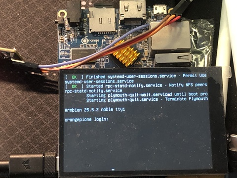

# 移植到其他平台



这里以 **OrangePi-One** 为例，下面是移植时开发板的状态：

| Device | OrangePi-One |
| --- | --- |
| Arch | arm |
| Distro | Armbian 25.5.2 |
| Kernel Version | 6.12.30-current-sunxi |

本文将分为两部分，前半部分会介绍如何快速部署我们开发的示例到开发板上，后半部分则是移植过程的详细说明。

## 快速部署示例

先拉取对应仓库，然后来到开发板对应的目录下：

```bash
git clone https://github.com/embeddedboys/pico_dm_yt350s006_linux.git
cd orangepi-one
```

编译设备树overlay以及固件，将编译好的文件放置到指定位置：

```bash
make

sudo cp panel-mipi-dbi.bin /lib/firmware/
sudo cp sun8i-h3-spi-st7796u-drm.dtbo /boot/dtb/overlays/
```

重启设备，然后手动加载驱动:
```
sudo reboot

sudo modprobe panel-mipi-dbi
```

如果一切顺利，屏幕已经正常显示内容。

### 开机自动加载

由于一些原因，在Armbian系统启动过程中，panel-mipi-dbi 驱动被过早的加载了，早于文件系统的挂载，因此，panel-mipi-dbi 驱动无法正常获取firmware文件（不在initramfs中），所以我们需要将firmware文件打包进initramfs中，下面是操作方法：

将initramfs 打包过程的 hook 脚本放置到指定的位置：
```bash
sudo cp initramfs-hook-panel-mipi-dbi-fw /etc/initramfs-tools/hooks/
sudo chmod u+x /etc/initramfs-tools/hooks/initramfs-hook-panel-mipi-dbi-fw
```

触发initramfs打包流程:
```bash
update-initramfs -u -v
```

检查打包后的内容:
```bash
root@orangepione:~# lsinitramfs /boot/initrd.img-$(uname -r) | grep panel-mipi-dbi-spi.bin
usr/lib/firmware/panel-mipi-dbi-spi.bin
```

然后重启设备，你可以发现在香橙派的启动过程中，屏幕自动点亮了。

## 移植过程

为什么使用 Armbian 来做演示？

这是因为 Armbian 和 Pi OS 一样使用了 DT overlay 机制，这使得我们可以不编写任何设备驱动代码，仅靠一些设备树 overlay 文件，在不更改内核代码的情况下，满足大部分的需求。

### 如何编写并应用一个 DT overlay 文件

首先要讲讲如何在 Armbian 上编写并应用一个 设备树 overlay 文件，这里以官方的 one-wire overlay 文件 `sun8i-h3-w1-gpio.dts` 为例:

```c
/dts-v1/;
/plugin/;

/ {
	compatible = "allwinner,sun8i-h3"; 

	fragment@0 {
		/*
		 * &pio 是要覆盖的节点，在本案例中，你可以在 sunxi-h3-h5.dtsi
		 * 这个文件中找到该节点的原型。
		 */
		target = <&pio>;

		__overlay__ {
			/* 添加的 pinctrl 配置，将 PD14 设置成 GPIO 输入模式*/
			w1_pins: w1_pins {
				pins = "PD14";
				function = "gpio_in";
			};
		};
	};

	fragment@1 {
		/* "/" 表示要操作根节点下的内容 */
		target-path = "/";

		/* 要修改的内容总是放在 __overlay__ 中 */
		__overlay__ {

			/*
			 * 这里就按照设备树的语法描述添加需要的节点
			 * 就行了，没有什么需要特殊说明的内容。
			 * 这里对应 drivers/w1/masters/w1-gpio.c 驱动
			 */
			onewire@0 {
				compatible = "w1-gpio";
				pinctrl-names = "default";
				pinctrl-0 = <&w1_pins>;
				gpios = <&pio 3 14 0>; /* PD14 */
				status = "okay";
			};
		};
	};
};
```

在编写完上述 overlay 文件之后，修改启动配置文件：

```bash
sudo vim /boot/armbianEnv.txt
```

在文件末尾添加以下配置:
```bash
overlays=w1-gpio
```

这里需要注意的是，如果有多个overlay，需要用空格分隔开。 这里不需要`sun8i-h3`前缀的原因是，配置文件中已经指定了`overlay_prefix`。

重启设备，你可以在 dmesg 中看到，overlay 文件所对应的驱动已经被加载了

### 如何使用 panel-mipi-dbi 驱动

我们在上一节了解了如何编写一个 overlay 来加载指定驱动，可是问题来了，对于一个陌生的
驱动程序，我们如何知道它需要哪些设备树配置呢？这就需要查阅内核中的 bindings 文档了。

你可以在内核代码的 `Documentation/devicetree/bindings` 目录下找到大部分驱动的设备树节点配置示例，panel-mipi-dbi 驱动的示例位于 `Documentation/devicetree/bindings/display/panel/panel-mipi-dbi-spi.yaml`，限于篇幅，我只在下面展示关键的部分：

```c
    #include <dt-bindings/gpio/gpio.h>

    spi {
        #address-cells = <1>;
        #size-cells = <0>;

        display@0{
            compatible = "sainsmart18", "panel-mipi-dbi-spi";
            reg = <0>;
            spi-max-frequency = <40000000>;

            dc-gpios = <&gpio 24 GPIO_ACTIVE_HIGH>;
            reset-gpios = <&gpio 25 GPIO_ACTIVE_HIGH>;
            write-only;

            backlight = <&backlight>;

            width-mm = <35>;
            height-mm = <28>;

            panel-timing {
                hactive = <160>;
                vactive = <128>;
                hback-porch = <0>;
                vback-porch = <0>;
                clock-frequency = <0>;
                hfront-porch = <0>;
                hsync-len = <0>;
                vfront-porch = <0>;
                vsync-len = <0>;
            };
        };
    };

```

现在，我们来仿照上面的配置创建 overlay，下面是 overlay 文件的内容:

```c
/dts-v1/;
/plugin/;

/ {
	compatible = "allwinner,sun8i-h3";

	fragment@0 {
		target = <&pio>;
		__overlay__ {
			tft_pins: tft_pins {
				pins = "PA2", "PA3";
				function = "gpio_out";
			};
		};
	};

	fragment@1 {
		target = <&spi0>;
		__overlay__ {
			status = "okay";

			tft: st7796u@0 {
				#address-cells = <1>;
				#size-cells = <1>;

				pinctrl-names = "default";
				pinctrl-0 = <&tft_pins>;

				compatible = "panel-mipi-dbi-spi";

				spi-max-frequency = <100000000>;
				reg = <0>;

				width-mm = <55>;
				height-mm = <84>;

				reset-gpios = <&pio 0 2 0>;
				dc-gpios = <&pio 0 3 0>;
				write-only;

				status = "okay";

				panel-timing {
					hactive = <480>;
					vactive = <320>;
					hback-porch = <0>;
					vback-porch = <0>;

					clock-frequency = <0>;
					hfront-porch = <0>;
					hsync-len = <0>;
					vfront-porch = <0>;
					vsync-len = <0>;
				};
			};
		};
	};
};
```

我们把这个文件保存为 `sun8i-h3-spi-st7796u-drm.dts`，然后编译成二进制：

```bash
dtc -@ -I dts -O dtb -o sun8i-h3-spi-st7796u-drm.dtbo sun8i-h3-spi-st7796u-drm.dts
```

讲这个文件拷贝到 `/boot/dtb/overlay` 文件夹下，修改 `/boot/armbianEnv.txt`，添加overlay配置：

```bash
sudo cp sun8i-h3-spi-st7796u-drm.dtbo /boot/dtb/overlay/
sudo vim /boot/armbianEnv.txt
```

```bash
overlays=spi-st7796u-drm
```

配置完成后，重启设备后，查看内核日志，你会发现如下报错：
```c
[    3.350494] panel-mipi-dbi-spi spi0.0: Direct firmware load for panel-mipi-dbi-spi.bin failed with error -2
[    3.350538] panel-mipi-dbi-spi spi0.0: Falling back to sysfs fallback for: panel-mipi-dbi-spi.bin
[   64.499684] panel-mipi-dbi-spi spi0.0: No config file found for compatible 'panel-mipi-dbi-spi' (error=-110)
[   64.499725] panel-mipi-dbi-spi spi0.0: probe with driver panel-mipi-dbi-spi failed with error -110
```

这是因为驱动没有找到有效的 firmware 文件，下面我们来介绍如何为 panel-mipi-dbi 驱动制作 firmware。

首先，你需要 `mipi-dbi-cmd` 这个工具，你可以在驱动作者的这个仓库中找到 [mipi-dbi-cmd](https://github.com/notro/panel-mipi-dbi/blob/main/mipi-dbi-cmd)，它是一个python脚本，把它下载到本地，添加可执行权限就可以了。

这是一个 firmware 的源文件示例, `rpi-dm-hp35006.txt` ：
```c
command 0xF0 0xC3
command 0xF0 0x96
command 0x36 0x28
command 0x3A 0x55
command 0xB4 0x01
command 0xB1 0x80 0x01
command 0xB5 0x1F 0x50 0x00 0x20
command 0xB6 0x8A 0x07 0x3B
command 0xC0 0x80 0x64
command 0xC1 0x13
command 0xC2 0xA7
command 0xC5 0x09
command 0xE8 0x40 0x8a 0x00 0x00 0x29 0x19 0xA5 0x33
command 0xE0 0xF0 0x06 0x0B 0x07 0x06 0x05 0x2E 0x33 0x47 0x3A 0x17 0x16 0x2E 0x31
command 0xE1 0xF0 0x09 0x0D 0x09 0x08 0x23 0x2E 0x33 0x46 0x38 0x13 0x13 0x2C 0x32
command 0xF0 0x3C
command 0xF0 0x69
command 0x35 0x00
command 0x11
delay 120
command 0x29
delay 50
command 0x21
```

寄存器操作以 `command` 命令开头，后面紧跟的是寄存器地址，在此之后的都是参数

延时操作以 `delay` 命令开头，后面紧跟的是毫秒数

编写完成后，使用 `mipi-dbi-cmd` 工具将其转成bin文件：
```bash
./mipi-dbi-cmd panel-mipi-dbi.bin rpi-dm-hp35006.txt
```

将 `panel-mipi-dbi.bin` 文件拷贝到 `/lib/firmware` 文件夹中，重新加载驱动，查看日志，你会发现驱动已经成功加载了：

```bash
sudo modprobe panel-mipi-dbi-spi
```

```bash
developer@orangepione:~$ dmesg | grep panel
[    3.343660] panel-mipi-dbi-spi spi0.0: supply power not found, using dummy regulator
[    3.344113] panel-mipi-dbi-spi spi0.0: supply io not found, using dummy regulator
[    3.378360] [drm] Initialized panel-mipi-dbi 1.0.0 for spi0.0 on minor 1
[    3.868253] panel-mipi-dbi-spi spi0.0: [drm] fb0: panel-mipi-dbid frame buffer device
```

但是屏幕仍然黑屏，这是因为没有开启背光导致的，现在，你可以通过 gpio sysfs 手动操作背光引脚来点亮背光，本案例中背光引脚为 PD14 ，对应编号 110，全志平台每32个gpio为一组：

PD14 = 32 * 3 + 14 = 110

```bash
echo 110 > /sys/class/gpio/export
echo out > /sys/class/gpio/gpio110/direction
echo 1 > /sys/class/gpio/gpio110/value
```

在执行完上述命令后，背光被激活，屏幕显示了内容。 

但是如何让其自动完成呢？为什么前面的panel-mipi-dbi的设备树节点没有背光配置？我们会在下一节描述这个问题。

### 屏幕的背光是个大问题

在上一节中，我们已经成功驱动了屏幕，可是屏幕还是没有亮，这是因为没有打开屏幕的背光，那如何在屏幕驱动加载时自动开启背光呢？

通常情况下，我们会在panel-mipi-dbi的设备树节点中添加这么一行配置：
```c
backlight = <&backlight>;
```

这个 `&backlight` 是在哪个节点中定义的呢？在绝大多数平台上，可以简单地这么编写设备树节点：

```c
backlight {
	compatible = "gpio-backlight";
	gpios = <&gpio3 4 GPIO_ACTIVE_HIGH>;
	default-on;
};
```

这将把 gpio3 的 4 号引脚作为背光的控制引脚，不过功能较为简单，只能控制开启和关闭。

为什么在 OrangePi-One 的 Armbian 上无法使用？我在这个背光的适配过程遇到了很多问题，让我们来逐个分析。 

#### 1. 系统中缺少 gpio-backlight 驱动的 ko 文件

在树莓派上，这个驱动位于 `/lib/modules/$(uname -r)/kernel/drivers/video/backlight/gpio-backlight.ko`。 但是我没有在 OrangePi-One 上找到这个驱动文件。

#### 2. 系统中有 pwm-backlight 驱动，但是 PD14 引脚没有 PWM 功能

`drivers/pinctrl/sunxi/pinctrl-sun8i-h3.c`
```c
static const struct sunxi_desc_pin sun8i_h3_pins[] = {
	...
	SUNXI_PIN(SUNXI_PINCTRL_PIN(D, 14),
		  SUNXI_FUNCTION(0x0, "gpio_in"),
		  SUNXI_FUNCTION(0x1, "gpio_out"),
		  SUNXI_FUNCTION(0x2, "emac")),		/* TXERR */
	...
};
```

那么最后我是如何解决这个问题的？好吧，如你所见，我尝试了一些方法，但是都不能实现在屏幕驱动加载时自动开启背光。 

我调转了思路，在启动时，驱动加载前自动将背光点亮。 虽然不够优雅，但是起码可以正常工作。 所以我尝试了一些方法，但还是遇到了一些问题，不过最后还是解决了，下面来逐个分析：

#### 3. gpio-hog 配置可以让某个指定引脚在 gpiochip 加载时设置一个固定状态
 
查看内核文档 https://www.kernel.org/doc/Documentation/devicetree/bindings/gpio/gpio.txt 有如下内容：

```txt
The GPIO chip may contain GPIO hog definitions. GPIO hogging is a mechanism
providing automatic GPIO request and configuration as part of the
gpio-controller's driver probe function.

Each GPIO hog definition is represented as a child node of the GPIO controller.
Required properties:
- gpio-hog:   A property specifying that this child node represents a GPIO hog.
- gpios:      Store the GPIO information (id, flags, ...) for each GPIO to
	      affect. Shall contain an integer multiple of the number of cells
	      specified in its parent node (GPIO controller node).
Only one of the following properties scanned in the order shown below.
This means that when multiple properties are present they will be searched
in the order presented below and the first match is taken as the intended
configuration.
- input:      A property specifying to set the GPIO direction as input.
- output-low  A property specifying to set the GPIO direction as output with
	      the value low.
- output-high A property specifying to set the GPIO direction as output with
	      the value high.

Optional properties:
- line-name:  The GPIO label name. If not present the node name is used.

Example of two SOC GPIO banks defined as gpio-controller nodes:

	qe_pio_a: gpio-controller@1400 {
		compatible = "fsl,qe-pario-bank-a", "fsl,qe-pario-bank";
		reg = <0x1400 0x18>;
		gpio-controller;
		#gpio-cells = <2>;

		line_b-hog {
			gpio-hog;
			gpios = <6 0>;
			output-low;
			line-name = "foo-bar-gpio";
		};
	};

	qe_pio_e: gpio-controller@1460 {
		compatible = "fsl,qe-pario-bank-e", "fsl,qe-pario-bank";
		reg = <0x1460 0x18>;
		gpio-controller;
		#gpio-cells = <2>;
	};
```

我根据文档中的示例配置了一个hog节点：

```c
	fragment@1 {
		target = <&pio>;
		__overlay__ {
			bl_hog {
				gpio-hog;
				gpios = <&pio 3 14 0>;
				output-high;
				line-name = "display-backlight";
			};
		};
	};
```

但这没有效果，重启后我没有在内核日志中看到任何与hog相关的内容，翻阅源码，有关
gpio-hog 的处理位于 `of_gpiochip_scan_gpios` 函数中 `drivers/gpio/gpiolib-of.c`，
如果gpio-hog被成功配置，那么在`drivers/gpio/gpiolib.c#L4182` 有如下日志逻辑：

```c
int gpiod_hog(struct gpio_desc *desc, const char *name,
	      unsigned long lflags, enum gpiod_flags dflags)
{
	...
	gpiod_info(desc, "hogged as %s%s\n",
		(dflags & GPIOD_FLAGS_BIT_DIR_OUT) ? "output" : "input",
		(dflags & GPIOD_FLAGS_BIT_DIR_OUT) ?
		  (dflags & GPIOD_FLAGS_BIT_DIR_VAL) ? "/high" : "/low" : "");
	...
}
```

我在google上搜索了相关问题，还有了些意外收获，树莓派的pinctrl驱动在早期版本因为pinctrl和gpiochip注册顺序问题导致了 gpio-hog 没有被正常处理，可以到如下树莓派论坛查看原贴内容

https://forums.raspberrypi.com/viewtopic.php?t=260600

以及相关的PR：

https://github.com/raspberrypi/linux/pull/3394

修改内容大致上是将 pinctrl 驱动的注册放到了 gpiochip 之前，产生这种问题的原因主要是现在处理器的pinctrl驱动大部分都是 pinctrl 和 gpiochip 驱动混合在一起的。

所以我查看了全志平台的 pinctrl 驱动，发现它并没有这个注册顺序问题，所以我不知所措了：

`drivers/pinctrl/sunxi/pinctrl-sunxi.c`
```c
int sunxi_pinctrl_init_with_variant(struct platform_device *pdev,
				    const struct sunxi_pinctrl_desc *desc,
				    unsigned long variant)
{
	...

	pctl->pctl_dev = devm_pinctrl_register(&pdev->dev, pctrl_desc, pctl);
	if (IS_ERR(pctl->pctl_dev)) {
		dev_err(&pdev->dev, "couldn't register pinctrl driver\n");
		return PTR_ERR(pctl->pctl_dev);
	}

	pctl->chip = devm_kzalloc(&pdev->dev, sizeof(*pctl->chip), GFP_KERNEL);
	if (!pctl->chip)
		return -ENOMEM;

	last_pin = pctl->desc->pins[pctl->desc->npins - 1].pin.number;
	pctl->chip->owner = THIS_MODULE;
	pctl->chip->request = gpiochip_generic_request;
	pctl->chip->free = gpiochip_generic_free;
	pctl->chip->set_config = gpiochip_generic_config;
	pctl->chip->direction_input = sunxi_pinctrl_gpio_direction_input;
	pctl->chip->direction_output = sunxi_pinctrl_gpio_direction_output;
	pctl->chip->get = sunxi_pinctrl_gpio_get;
	pctl->chip->set = sunxi_pinctrl_gpio_set;
	pctl->chip->of_xlate = sunxi_pinctrl_gpio_of_xlate;
	pctl->chip->to_irq = sunxi_pinctrl_gpio_to_irq;
	pctl->chip->of_gpio_n_cells = 3;
	pctl->chip->can_sleep = false;
	pctl->chip->ngpio = round_up(last_pin, PINS_PER_BANK) -
			    pctl->desc->pin_base;
	pctl->chip->label = dev_name(&pdev->dev);
	pctl->chip->parent = &pdev->dev;
	pctl->chip->base = pctl->desc->pin_base;

	ret = gpiochip_add_data(pctl->chip, pctl);
	if (ret)
		return ret;

	...
}
```

我不知道这是不是由于缺少了 `pinctrl_add_gpio_range` 调用的缘故，你可以看到树莓派的 pinctrl 驱动（`drivers/pinctrl/bcm/pinctrl-bcm2835.c`）这么做了，全志的 pinctrl 驱动则使用了 `gpiochip_add_pin_range`。 

总之我没有让 `gpio-hog` 在这个平台上成功启用，我不是 pinctrl 与 gpio 驱动的专家，且由于修改内核代码不是很方便，你需要拉取armbian 的 build 仓库构建，操作起来类似于buildroot。 我也没有太多精力能放在这上面，所以我也就没有继续研究下去了。

#### 4. 取巧的方法，通过 gpio-leds 驱动点亮背光

我在翻看 OrangePi-One 的设备树文件时，发现了一些状态灯的配置：

```c
	leds {
		compatible = "gpio-leds";

		pwr_led {
			label = "orangepi:green:pwr";
			gpios = <&r_pio 0 10 GPIO_ACTIVE_HIGH>;
			default-state = "on";
		};

		status_led {
			label = "orangepi:red:status";
			gpios = <&pio 0 15 GPIO_ACTIVE_HIGH>;
		};
	};
```

这个 `pwr_led` 位于 OrangePi-One 正面的 gpio 接口旁，绿色灯光，鉴于它是连接到某个gpio引脚，所以它是正常工作的。 但是我没有在 `/lib/modules/$(uname -r)/kernel/drivers/leds` 下找到这个驱动，这说明它被编译进了内核中。

所以我仿照它编写了一个背光灯配置节点，结果很成功。 不过屏幕背光被过早地开启了。

```c
	fragment@0 {
		target-path = "/";
		__overlay__ {
			bl_leds {
				compatible = "gpio-leds";

				pinctrl-names = "default";
				pinctrl-0 = <&bl_pins>;

				bl_led0 {
					label = "display:backlight";
					gpios = <&pio 3 14 0>;
					default-state = "on";
				};
			};
		};
	};
```

### 让触摸屏工作起来

## 参考资料