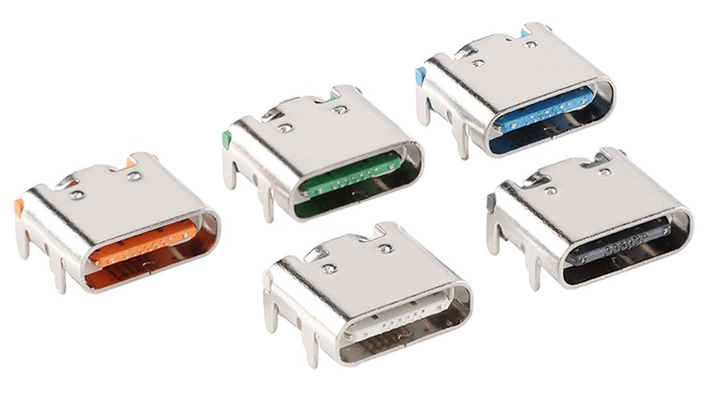
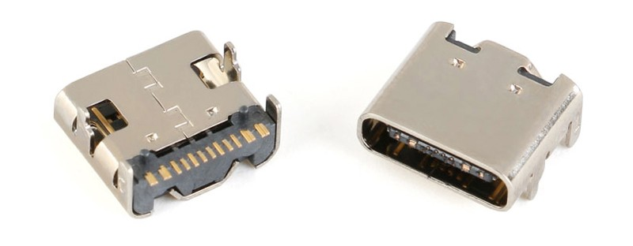

## 工具准备

- Raspberry Pi 系列开发板
- 电烙铁
- 加热台
- 焊锡丝、锡膏、助焊剂
- 尖头镊子

## 器件采购

我们根据器件类型进行了分类，并为每种所需器件提供了链接和规格，请根据规格参数进行采购。

如果您找到了更经济的替代品，请随时使用，并向我们提供反馈。

这里有一份BOM表: [文件链接](./assets/BOM_RPI_DM_YT350S006_RPI_DM_YT350S006_2024-11-24.xlsx)

### 屏幕

我们在此列出与本项目兼容的屏幕型号，您按照需求选择型号、触摸类型等规格。

| 器件链接 | 颜色分类 | 型号 | 面板类型 | 触摸类型 | 价格（￥） |
| --- | --- | --- | --- | --- | --- |
| [耀元鸿3.5寸TFT液晶显示屏并口串口电阻屏5点电容屏GT911彩屏LCD](https://item.taobao.com/item.htm?_u=o1m6r7hs78cf&id=521624918530&spm=a1z09.2.0.0.7df32e8dWy47pb) | ST7796U-显示屏 | YT350S006 | TFT | 无 |  25.9 |
| [耀元鸿3.5寸TFT液晶屏IPS全视角显示屏5点电容屏触摸LCD彩屏GT911](https://item.taobao.com/item.htm?_u=o1m6r7hs1efd&id=680271103710&spm=a1z09.2.0.0.7df32e8dWy47pb&skuId=5045244538637) | 显示屏 | HP35006-D | IPS | 无 | 29.9 |
| [3.5寸显示屏模块TFT电阻电容触摸屏插接40pin串口屏ST7796ILI9488](https://item.taobao.com/item.htm?_u=o1m6r7hs443f&id=746237125081&spm=a1z09.2.0.0.7df32e8dWy47pb) | ST7796-TFT显示屏（不带触摸）| CL35BC1017-40A | TFT | 无 | 26 |
| [3.5寸SPI串口屏MCU电容触摸屏IPS显示屏模块ST7796/9488插接40pin](https://item.taobao.com/item.htm?_u=o1m6r7hs6e37&id=746111420119&spm=a1z09.2.0.0.7df32e8dWy47pb&skuId=5144682556436) | ST7796-IPS显示屏（不带触摸） | CL35BC219-40A | IPS | 无 | 28 |

:::info **TFT 与 IPS 屏幕的区别**

TFT 是液晶屏的基础技术，成本低，但视角和色彩表现一般；IPS 是基于 TFT 改进的技术，视角更广，色彩更好，但成本较高。IPS 更适合对显示质量要求高的场景，TFT 适合经济型设备。
:::

### 排针、排母

| 器件链接 | 塑胶高度 | 塑胶材料 | P 位 | 数量 |
| --- | --- | --- | --- | --- |
| [2.54MM间距 双排加塑直母 加高排母 环保镀金 耐高温 加高连接器](https://item.taobao.com/item.htm?_u=61m6r7hsbb73&id=674868573155&spm=a1z09.2.0.0.17a62e8dphmLvm&skuId=5025763722818) | 加高5MM 塑高13.5MM | PA6T耐高温材料 | 2X13P | 1 |

---------------------------------------------------------------

| 器件链接 | 颜色分类 | 数量 |
| --- | --- | --- |
| [卧贴针 2.0MM 2.54MM 卧式贴片排针 单针 双排针 1*40P 2*40P 5条](https://item.taobao.com/item.htm?_u=o1m6r7hs8d08&id=629837495935&spm=a1z09.2.0.0.512c2e8d12wMQ5&skuId=4647519223483) | 2.54MM 1*40P 卧贴排针 5条 | 1 |

:::tip
如果您不需要焊接排针接口，例如风扇或串口引出，就无需购买。

您也可以选择使用标准的2.54毫米直插排针进行替代。
:::

---------------------------------------------------------------

### FPC连接器

| 器件链接 | 颜色分类 | 型号 | 封装 | 数量 |
| --- | --- | --- | --- | --- |
| [FFC/FPC连接器0.5MM 上接 下接 翻盖下接 4/6/8/10/12/14/16—40P](https://item.taobao.com/item.htm?_u=61m6r7hs5bc1&id=552629356951&spm=a1z09.2.0.0.44782e8d777Y80) | 40P | 上接 | 编带 | 1 |
| [FFC/FPC连接器0.5MM 上接 下接 翻盖下接 4/6/8/10/12/14/16—40P](https://item.taobao.com/item.htm?_u=61m6r7hs5bc1&id=552629356951&spm=a1z09.2.0.0.44782e8d777Y80) | 8P  (**GT911**) | 翻盖下接 | 编带 | 1 |
| [FFC/FPC连接器0.5MM 上接 下接 翻盖下接 4/6/8/10/12/14/16—40P](https://item.taobao.com/item.htm?_u=61m6r7hs5bc1&id=552629356951&spm=a1z09.2.0.0.44782e8d777Y80) | 6P (**FT6336**) | 翻盖下接 | 编带 | 1 |

### 电容、电阻、三极管

| 器件链接 | 用量 |
| --- | --- |
| [贴片 S8050 J3Y 贴片三极管 500MA SOT-23（20只）](https://item.taobao.com/item.htm?id=522577964105) | 1 |
| [0603贴片电阻 10R 10欧 1/10W 精度±1% （50只）](https://item.taobao.com/item.htm?id=525724626983) | 1 |
| [0603贴片电阻 1KΩ 1千欧 1/10W 精度±1% （50只）](https://item.taobao.com/item.htm?id=525795113143) | 1 |
| [0603贴片电阻 2.2KΩ 2.2千欧 1/10W 精度±1% （50只）](https://item.taobao.com/item.htm?id=525826728150) | 2 |
| [0603贴片电容50V 100NF ±10% X7R CL10B104KB8NNNC 50只](https://item.taobao.com/item.htm?id=537743724825) | 3 |

------------------------

### USB 转串口

在某些情况下，通过USB转串口来登录控制台可能更加便捷。

:::tip

<mark>如果您不需要这项功能，就无需购买。</mark> | [前往下一节](#电阻触摸驱动ic)

:::

#### Type-C 母座

:::tip

我们提供两种Type-C母座供您选择，您可以根据个人喜好选择适合的一种。

:::

| 器件链接     | 颜色分类 | 数量 |
|--------|----------------------| --- |
| [彩色 USB Type-C 16P母座](https://item.taobao.com/item.htm?_u=o1m6r7hs0171&id=737614485085&spm=a1z09.2.0.0.7df32e8dWy47pb) | 白、橙、蓝、绿、黑色任选 | 1                    |

---------------------------------------------------------------

| 器件链接     | 颜色分类 | 数量 |
|--------|----------------------| --- |
| [单色 USB Type-C 16P母座](https://item.taobao.com/item.htm?id=573090887123) | 白、橙、蓝、绿、黑色任选 | 1                    |

--------------------------------

#### CH340N

| 器件链接     | 封装 |数量 |
|--------| --- | --- |
| [贴片 CH340N SOP-8 USB转串口IC芯片 内置晶振](https://item.taobao.com/item.htm?id=58605175794) | SOP-8 | 1 |

### 电阻触摸驱动IC

:::caution

<mark>如果您购买的显示屏不含电阻式触摸屏或不具备触摸功能，请不要购买本节中的相关器件。</mark>

:::

:::info **NS2009 和 TSC2007 的区别**

NS2009 和 TSC2007 的功能相似，但 TSC2007 配备了硬件滤波器，因此价格较高。在目前测试的屏幕中，NS2009 已能够满足所有需求。

下面的两个器件，选择其一即可。

:::

------------------

| 器件链接     | 封装 | 数量 |
|--------|----------------------| --- |
| [全新原装 NS2009 贴片MSOP10 4线电阻触摸屏控制器芯片，I2C接口](https://item.taobao.com/item.htm?_u=o1m6r7hs6aa9&id=650547292663&spm=a1z09.2.0.0.67002e8dx4F5CY) | MSOP10 | 1                    |

| 器件链接     | 封装 | 数量 |
|--------|----------------------| --- |
| [TSC2007IPWR TSSOP16 进口 TSC2007 模数转换芯片 原装热卖](https://item.taobao.com/item.htm?_u=o1m6r7hs013b&id=530525529861&spm=a1z09.2.0.0.67002e8dx4F5CY) | TSSOP16 | 1                    |

---------------------

### ESD（防静电） 器件

:::caution

裸露的排针及 Type-C 接口容易受到静电的危害，严重的情况可能会导致后级电路损毁。 如果您没有焊接这些器件，则不必担心。

防静电器件**不是必须的**，但是可以增加您的设备安全性。

:::

| 器件链接     | 封装 | 用量 |
|--------|----------------------| --- |
| [TPD4E05U06DQAR USON-10 4通道ESD保护二极管阵列](https://item.taobao.com/item.htm?_u=r1m6r7hs8859&id=664269852527&spm=a1z09.2.0.0.2ed12e8djqetXo) | USON-10 | 1 |
| [LESD5Z5.0CT1G SOD-523 ESD防静电二极管保护芯片 20只](https://item.taobao.com/item.htm?_u=r1m6r7hs7c07&id=661477857255&spm=a1z09.2.0.0.2ed12e8djqetXo) | SOD-523 | 8 |

## 打样PCB板

本项目的PCB工程基于嘉立创EDA设计，目前已经开源到嘉立创开源广场。

### 选择PCB工程

:::tip

屏幕的尺寸和排线的位置有些许的差异，因此需要采用不同的工程设计来进行适配。

:::

#### [RPi_DM_YT350S006]

兼容的屏幕型号：

- YT350S006
- HP35006-D

#### [RPi_DM_CL35BC219-40A]

兼容的屏幕型号：

- CL35BC219-40A
- CL35BC1017-40A

### 生成Gerber文件

1. 打开您需要的PCB文件，然后选择 **[导出]** -> **[PCB制板文件(Gerber)]**
2. 在弹出的窗口中选择 **[导出Gerber]**
3. 在弹出的警告窗口中选择 **[否，继续导出]**

:::info
屏幕的固定孔位违反DRC规则，但不影响板子电气性。
:::

### 下单