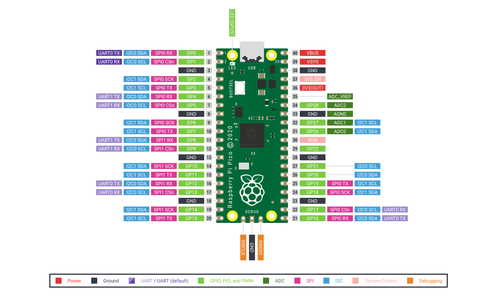
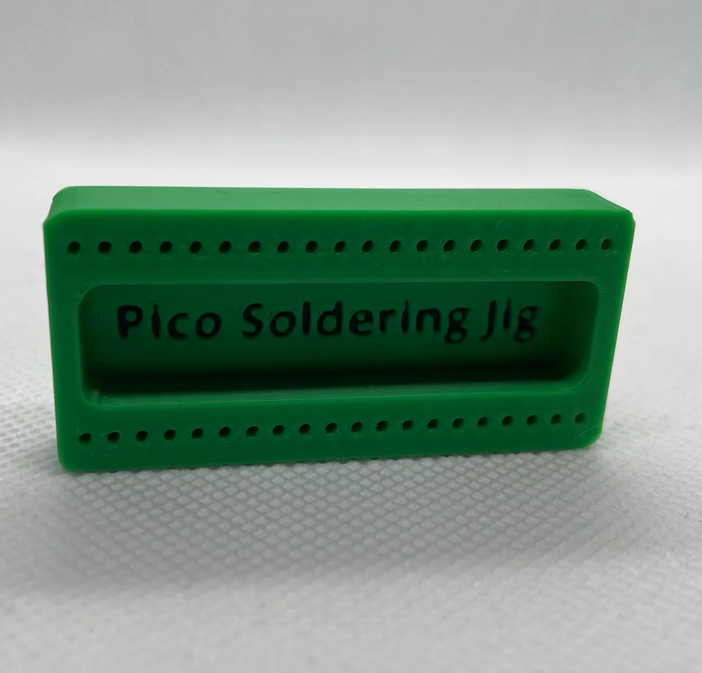
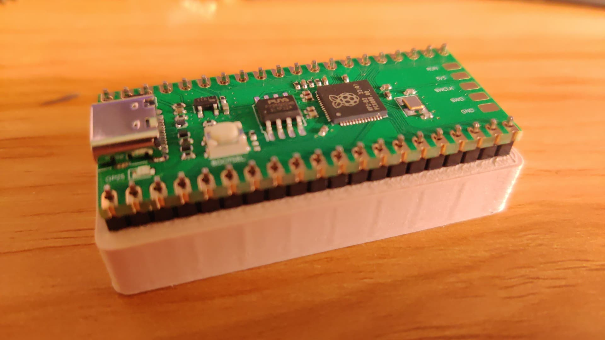

## 说明

我们默认不提供核心板，主要有如下几个原因：

- 核心板利润过低，市场均价10元左右
- 用户自行选择可增加灵活性
- 规格不同，不一定符合用户需求

:::danger
在选购Pico核心板时，一定要注意核心板的引脚分布是否与官方一致，**否则可能会损坏显示屏模组和核心板**
:::

官方版本引脚分布图如下：

## 核心板的焊接

如果您自行准备核心板，那么在焊接排针的时候，应该以**排针向下**的方式焊接。

在焊接核心板排针的时候，可能会因对齐问题导致排针焊歪，此时可以使用如下3D打印模型辅助：[pico-soldering-jig.stl](http://embeddedboys.com/uploads/pico-soldering-jig.stl)

将排针放至孔中，再放上Pico，就像这样：

然后就可以开始焊接啦

:::danger

不要将排针向上焊接的核心板安装到显示屏模组中！

:::

## 核心板的安装与卸载

:::danger
错误的安装可能会损坏核心板和模组！
:::

<mark>核心板USB接口方向一定要对准电路板上丝印USB标识处</mark>，将两排排针对准排母，两边同时用力按下，注意不要按坏屏幕，另一只手可以手掌托着屏幕一侧（增大受力面积），按压至最低端无法继续前进即可。 如果核心板安装后，两侧不处于同一平面，通常有一下两个原因：

1. 核心板两侧受力不均，导致核心板一边卡在排母中，此情况可以将核心板拔出重新安装。
2. 在焊接过程中，部分锡浆流入排母中造成轻微堵塞。

以上两个原因一般都不影响正常使用，如果用户在多次尝试安装后，显示模组仍存在显示问题，可以联系我们进行更换。

:::tip
在移除核心板时，建议使用IC起拔器，否则核心板两端受力不均会导致核心板的排针弯曲，在将其修正前无法插入模组中
:::