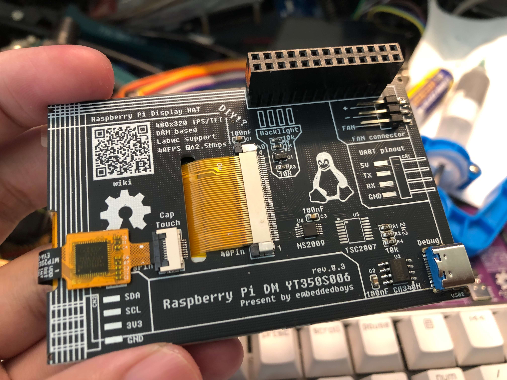

# 介绍

**RPi DM YT350S006** 是一款经济实惠的显示扩展板，专为树莓派设计，用于增强其显示交互功能。与传统的显示扩展板不同，它直接由内核提供显示支持，相较于传统的 fbcp 等方案，效率有所提高。

我们设计这款产品的初衷，是为了让每一个对树莓派感兴趣的用户都能够DIY一个属于自己的低成本显示扩展板。因此，本项目中使用的所有器件都是精挑细选的。您可以购买我们的成品以支持我们的开发工作，同时，我们也会提供一个页面，详细介绍器件采购和DIY过程。

最后，祝各位 Happy hacking!

<!-- 演示视频链接:
[https://www.bilibili.com/video/BV1aD42177CE/](https://www.bilibili.com/video/BV1aD42177CE/) -->

## 传送门

### [我已经有了拓展板](/docs/get-started/driver-install)
### [我想自己DIY](/docs/diy/preparations)

## 特性

- 低成本DIY
- 基于 DRM 显示驱动
- Labwc 支持
- 一行式驱动安装脚本
- 在 62.5Mbps 的 4-wire SPI 接口下有平均 **40fps** 的刷新率1
- 可选 IPS/TFT 显示面板
- 可选 3.5寸电容/电阻式触摸屏

## 产品规格

|  | RPi DM YT350S006                    |
|----------|--------------------------------------|
| 显示屏     | 3.5寸 TFT 480x320 ST7796U 4-wire SPI @100MHz(max) |
| 触摸屏     | 可选 3.5寸 电容/电阻式触摸 GT911/NS2009/TSC2007                          |

## 购买链接

### 暂无

> 1 在树莓派5上通过 [testufo](https://www.testufo.com) 默认设置全屏测试得出
