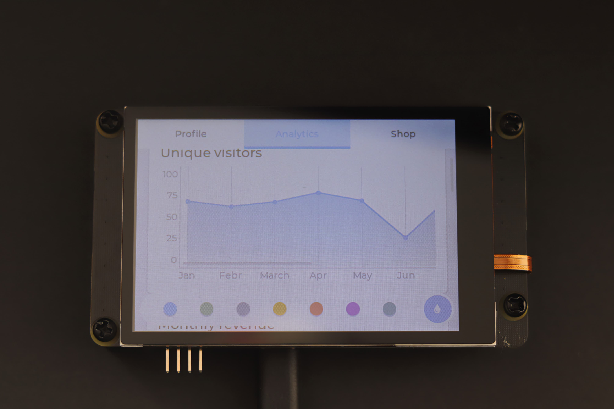

# 介绍

**Pico_DM_YT350S006** 是基于树莓派 Pico 设计的一款低成本显示拓展板，用来学习、评估、开发LVGL或其他GUI应用。

<!-- 演示视频链接:
[https://www.bilibili.com/video/BV1aD42177CE/](https://www.bilibili.com/video/BV1aD42177CE/) -->

树莓派 RP2040 是树莓派的首款微控制器。它为微控制器领域带来了高性能，低成本和易于使用的标志性价值。

With a large on-chip memory, symmetric dual-core processor complex, deterministic bus fabric, and rich peripheral set augmented with our unique Programmable I/O (PIO) subsystem, it provides professional users with unrivalled power and flexibility.

凭借巨大的片上内存、对称双核处理器、确定性总线结构和丰富的外设，以及我们独特的可编程I/O (PIO)子系统，它为专业用户提供了无与伦比的功能和灵活性。

With detailed documentation, a polished MicroPython port, and a UF2 bootloader in ROM, it has the lowest possible barrier to entry for beginner and hobbyist users.

有了详细的文档，一个精美的MicroPython端口，以及ROM中的UF2引导加载程序，它对初学者和爱好者用户来说具有最低的入门门槛。

## 产品参数

|  | Pico_DM_YT350S006                    |
|----------|--------------------------------------|
| 显示屏     | 3.5寸 TFT 480x320 4-wire SPI ST7796U |
| 触摸屏     | 可选 3.5寸 电容/电阻式触摸 GT911/NS2009/TSC2007                          |

## 支持的平台

| | Raspberry Pi Pico | Raspberry Pi Pico2 | Luckfox Pico/Pro/Max | Milk-V Duo |
| --- | --- | --- | --- | --- |
| 芯片       | 树莓派 RP2040                        |
| 处理器     | 2x ARM Cortex-M0+ @ 133MHz        |
| 内存       | 264 KB SRAM                          |
| 闪存       | 最大 16MB                            |
