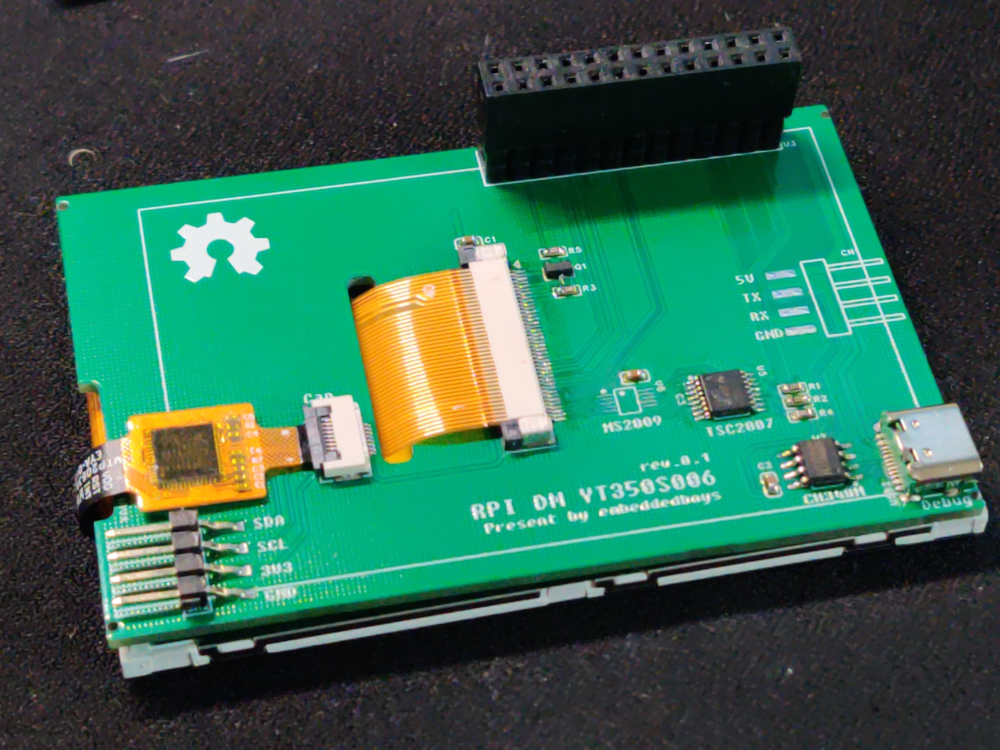

# 介绍

**RPi DM YT350S006** 是基于树莓派设计的一款低成本显示拓展板，用来为树梅派提供显示交互功能。 它与传统的显示拓展板最大的区别是，直接由内核提供显示功能，相较于传统的fbcp等方案，效率有些许的提升。

我们设计这款产品的初衷是，让每一个感兴趣的树莓派用户都可以DIY一个属于自己的低成本显示拓展板，所以本项目中使用的所有器材都是精挑细选且可以从淘宝上直接购买的。您可以购买我们的成品以支持我们的开发工作，同时我们也会提供一个页面，在其中详细介绍器件的购买和DIY过程。

最后，祝各位 Happy hacking!

<!-- 演示视频链接:
[https://www.bilibili.com/video/BV1aD42177CE/](https://www.bilibili.com/video/BV1aD42177CE/) -->

### [我已经有了拓展板](/docs/get-started/firmware)

### [我想自己DIY](/docs/diy/preparations)

## 特性

- 可DIY 低成本
- 基于 DRM 显示驱动
- Labwc 支持
- 在 62.5Mbps 的 4-wire SPI 接口下有平均 **40fps** 的刷新率
- 可选 IPS/TFT 显示面板
- 可选 3.5寸电容/电阻式触摸屏

## 产品规格

|  | RPi DM YT350S006                    |
|----------|--------------------------------------|
| 显示屏     | 3.5寸 TFT 480x320 4-wire SPI ST7796U @100MHz(max) |
| 触摸屏     | 可选 3.5寸 电容/电阻式触摸 GT911/NS2009/TSC2007                          |

## 购买链接