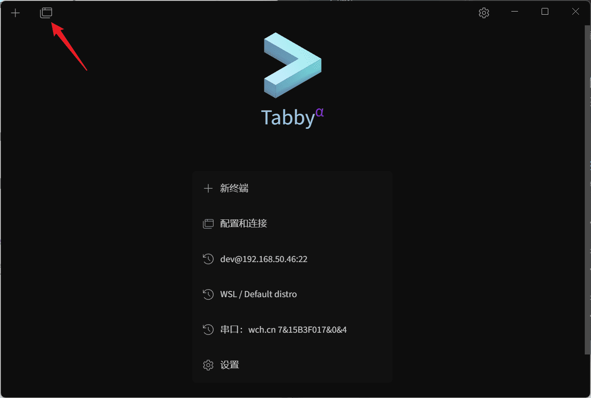
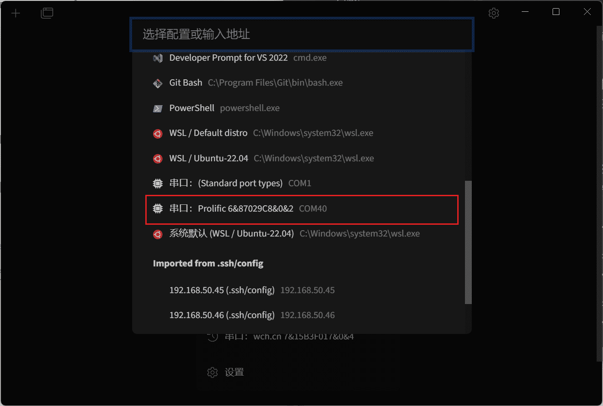
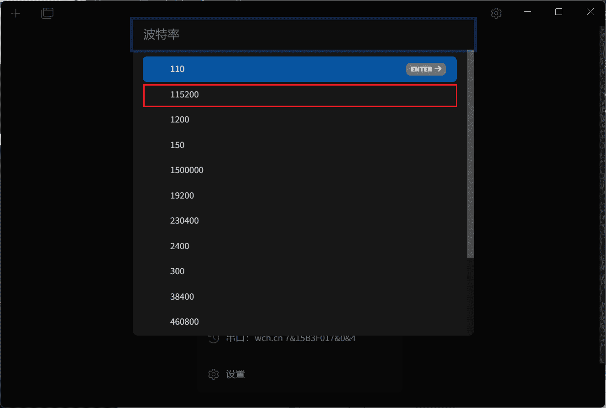
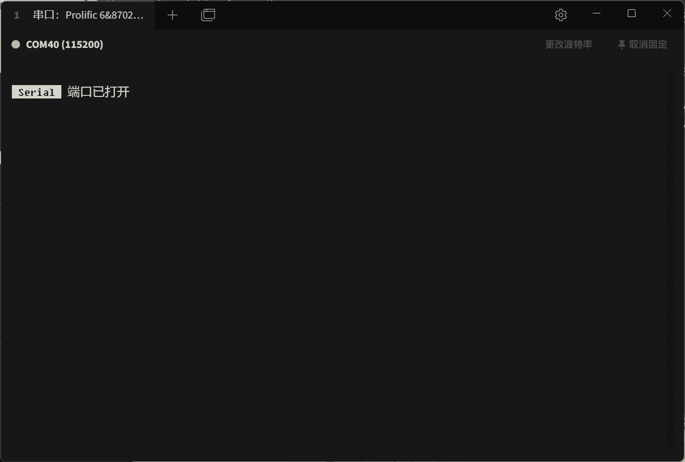
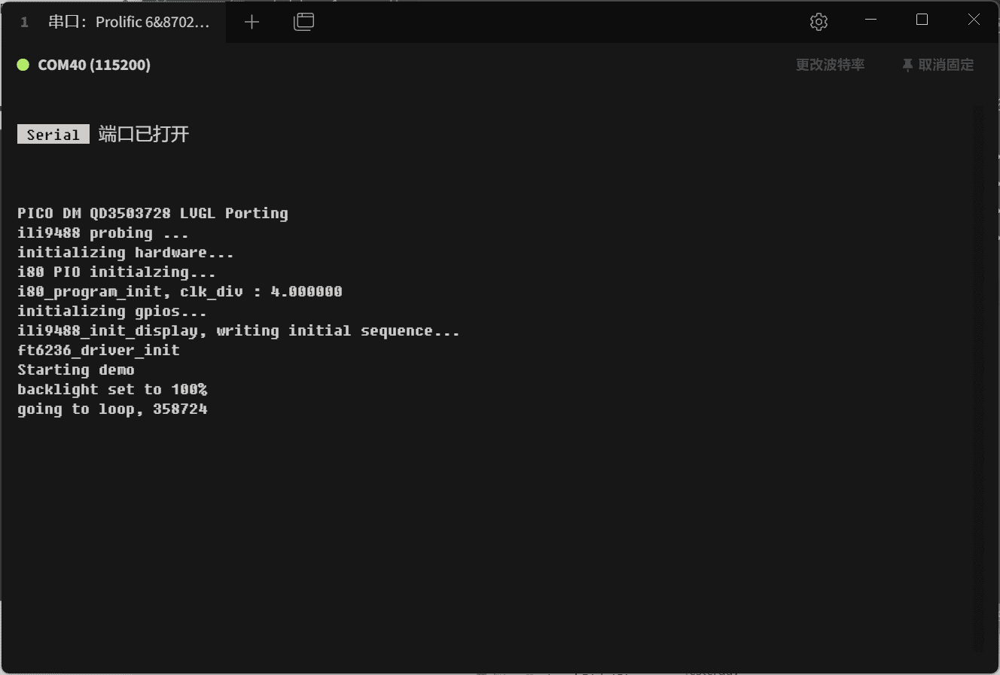

1. 将串口模块一端连接电脑，另一端连接到 Pico_DM_QD3503728 主板背部的引脚标识TX、RX、GND上，如下图所示

2. 下载 Tabby 软件，可从如下链接下载

国内用户：

国外用户：[https://github.com/Eugeny/tabby/releases/latest](https://github.com/Eugeny/tabby/releases/latest)

3. 打开 Tabby 软件，点击如下按钮，找到对应串口，设置波特率为115200

4. 复位板子，可以看到串口日志输出

